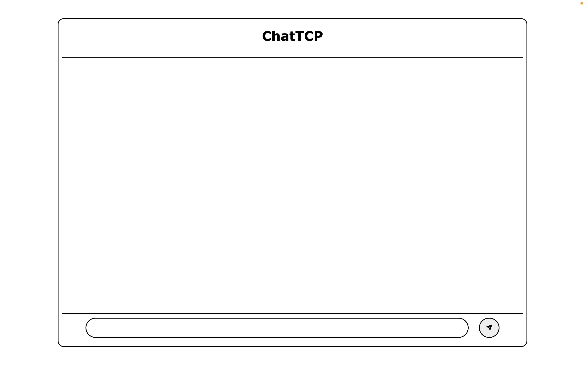

# TCP Chat sever

Logs

Week 1 3&4 Februari
Begonnen met een kort print programma in python
[Github-pagina](https://github.com/TimonDeBeste/cautious-engine)
En we kozen om een TCP protocol chat server te maken

Week 2
10&11 Februari
Quinten
1ste versie server met directe python terminal clients
Timon
Begin aan website

Week 3
17&18 Februari
Proxmox server en ubuntu server VMs gemaakt
Quinten
Begin aan API en server veranderen
Timon
Verder met website (Github pages en apache2)

week 4
3&4 Maart
Timon
Apache2 server werkt, ziet er zo uit:

```html

```

week 5
17&18 Maart

week 6
24&25 Maart
